  

 

 

  

 

## 🧰 &nbsp;Stack

  

 

  

 

## 🎯 &nbsp;Focus

Data analyst and software developer passionate about building predictive models, interactive business intelligence dashboards, and robust backend database systems.

 

Currently focused on developing real-time predictive systems, data pipelines, and scalable database architectures.

 

## 🏛️ &nbsp;Core Initiatives & Projects

Systems built for real-world utility — structured around problem-solving, clean data modeling, and actionable insights.

 

<table>
<tr>
<td width="50%" valign="top">

#### 🌦️ &nbsp;Live Weather & Rain Prediction System
Real-time meteorological prediction web interface

*Problem* — unpredictable weather patterns requiring accessible, real-time forecasts and data visualization 
*Architecture* — Python and FastAPI backend integrated with live weather data streams and predictive ML models for accurate forecasting 
*Business impact* — delivers instant, user-friendly weather predictions via a clean web interface

`Python` `FastAPI` `Machine Learning` `Streamlit`

</td>
<td width="50%" valign="top">

#### 📊 &nbsp;E-Commerce Sales Dashboard
Interactive Power BI analytics platform

*Problem* — lack of centralized visibility into multi-channel e-commerce sales performance and revenue drivers 
*Architecture* — Power BI data modeling connecting raw sales datasets to dynamic charts, filtering KPIs by region, category, and time 
*Business impact* — enabled fast executive decision-making through clear visualization of top-selling products and revenue trends

`Power BI` `Data Analysis` `SQL`

</td>
</tr>
<tr>
<td width="50%" valign="top">

#### 🗄️ &nbsp;Student Management System
Reliable backend recordkeeping with MySQL

*Problem* — disorganized student record handling prone to data inconsistency and slow retrieval times 
*Architecture* — relational database schema designed in MySQL with optimized queries, secure CRUD operations, and clean backend integration 
*Business impact* — streamlined administrative workflows and ensured secure, reliable data persistence

`MySQL` `Python` `Database Design`

</td>
<td width="50%" valign="top">

#### ✈️ &nbsp;Tour & Travels Platform
Comprehensive travel planning and booking workflow

*Problem* — fragmented user experiences when exploring destinations and planning itineraries 
*Architecture* — full-featured web platform incorporating curated destination guides, user interactive itineraries, and smooth booking navigation 
*Business impact* — simplified travel research and booking into a single cohesive user journey

`Python` `Web Development` `UI/UX`

</td>
</tr>
</table>

📂 &nbsp;Explore more repositories — Data Science, Streamlit Apps, and Python utilities

 

📈 &nbsp;**EDA Data-sets** — exploratory data analysis notebooks uncovering hidden correlations and trends across diverse datasets.

⚡ &nbsp;**Streamlit Apps** — lightweight interactive web apps built in Python for rapid data prototyping and visualization.

🤖 &nbsp;**MLops & Python Class** — academic and experimental scripts exploring core machine learning algorithms and advanced python programming.

 

## 📈 &nbsp;GitHub activity

 

 

 

💬 &nbsp;Open to discussions on data analytics, machine learning, and software development.
 
<a href="https://www.linkedin.com/in/YOUR-LINKEDIN-HANDLE">LinkedIn</a> · <a href="https://github.com/rajputr274">GitHub</a>

